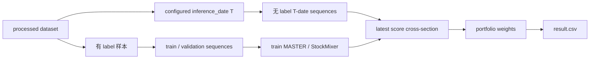
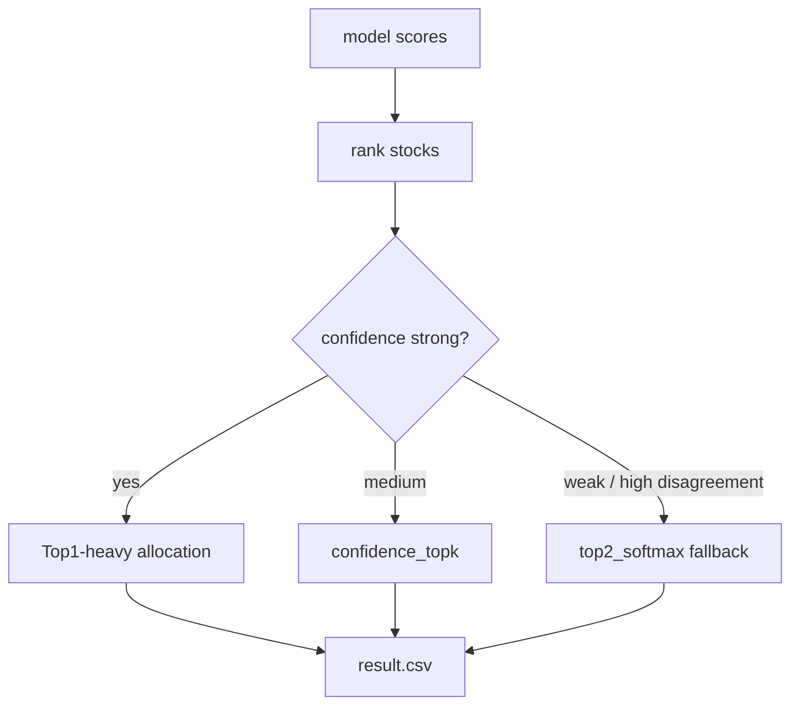
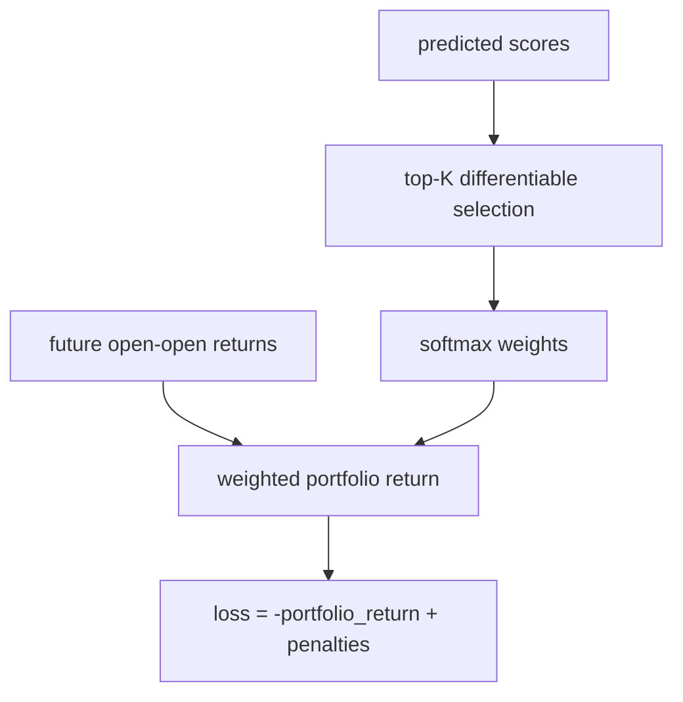
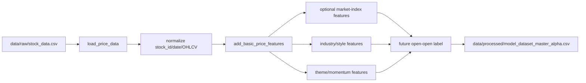

# 代码审查与模型复盘简报 - 2026-05-07

## 会议目标

这次会审主要对齐五件事：

- 项目实际使用了哪些数据；
- 当前 pipeline 如何从数据生成提交文件；
- 已验证的方法里哪些有效、哪些失败；
- 现在最大的工程和建模风险在哪里；
- 下一阶段应该优先推进什么。

## 核心结论

项目已经从“全市场收益率排序”逐步转向更贴近比赛目标的“组合收益最大化”。目前最重要的发现不是新模型，而是日期对齐问题：早期生成结果时使用了最后一个有 label 的验证日 `2026-04-20`，而线上真正需要的是无 label 的推理日 `2026-04-24`。

修复 latest inference，并允许更集中的组合分配后，A 阶段 replay 从公开成绩：

```text
0.012833583539611287
```

提升到：

```text
0.1066892464013548
```

当前生产结果是进攻型 `Top1`：

```csv
stock_id,weight
002493,1.0
```

但 `Top1` 方差高。它适合作为冲榜候选，不适合作为唯一长期默认策略。

## 数据概览

### 原始股票数据

本地原始文件：

```text
data/raw/stock_data.csv
```

规模：

```text
723,269 rows x 12 columns
```

字段：

```text
股票代码, 日期, 开盘, 收盘, 最高, 最低, 成交量, 成交额, 振幅, 涨跌额, 换手率, 涨跌幅
```

覆盖范围：

```text
300 stocks
2,747 trading dates
local raw date range: 2015/1/12 -> 2026/4/9
```

归一化后的 processed 表包含到 `2026-04-24`，因为建模数据里合并了补充/latest 行。

### 建模数据

本地 processed 文件：

```text
data/processed/model_dataset_master_alpha.csv
```

规模：

```text
723,269 rows x 301 columns
300 stocks
2015-01-05 -> 2026-04-24
```

主要特征组：

- 原始 OHLCV、成交额；
- 短/中窗口收益率、波动率；
- 均线比例、价格位置；
- 截面 rank 和 z-score；
- 行业、风格特征；
- beta、liquidity、volatility、correlation relation 特征；
- theme/momentum/breakout 特征。

### 外部数据状态

当前 repo 没有使用预训练外部模型。

主要数据来源是：

- 比赛/本地股票 OHLCV 数据；
- HS300 股票列表；
- 本地生成的 processed 特征；
- AkShare 获取的 A 阶段 replay 实际价格，仅用于赛后复盘评估，不用于官方训练和预测。

重要 caveat：

```text
data/raw/hs300_index.csv 当前本地不存在
```

因此市场指数特征必须被视为 optional，或者来自此前已经生成好的 processed artifact。

## Pipeline 概览

系统有四个主阶段：

1. 数据归一化和特征生成。
2. 为有 label 样本构造训练/验证序列。
3. 为无 label 的 `T` 日截面单独构造 latest inference 序列。
4. 根据预测分数构造组合并验证。

修复后的核心逻辑：

```text
Training: labeled samples only
Inference: unlabeled T-date cross-section
Submission: weights generated from T-date prediction scores
```

A 阶段 replay 的时间定义：

```text
T = 2026-04-24
Buy open = 2026-04-27
Sell open = 2026-04-30
```

## 当前方法

### MASTER Official

`MASTER` 当前是主线模型，包含：

- stock feature projection；
- market/context projection；
- transformer encoder；
- market-guided gate；
- cross-attention 和 temporal pooling；
- regression、rank、correlation、listwise 等 loss。

优点：

- 当前最强的单模型基础；
- 91 个验证日上相对稳定；
- latest inference path 已修复；
- 与集中式和 confidence-aware portfolio 策略结合较好。

局限：

- 原生目标并不完全等于最终 portfolio return；
- `Top1` 输出方差高；
- 第一版 portfolio-return loss 明显过拟合。

### StockMixer

`StockMixer` 使用：

- feature-group projection；
- channel/token mixer；
- recent weighted pooling；
- 多 patch recent windows。

优点：

- 比完整 `MASTER` 更轻、更快；
- 可以作为 regime 切换候选；
- fast/official 配置的 latest inference 已修复。

局限：

- 当前 fast 版本在历史验证上弱于 `MASTER`；
- official 版本更慢；
- 最新 replay 中 candidate switching 仍选择 `MASTER`。

### Multi-Seed MASTER

`Multi-seed MASTER` 对不同 seed 的 score 求均值，并计算 `score_std`。

优点：

- 历史 multi-method validation 中，配合 `top2_softmax` 的均值最好；
- `score_std` 可直接作为不确定性估计。

局限：

- latest inference 端到端还需要补齐；
- 历史结果还不能直接替代生产 latest submission。

### Relation 与后处理

Relation postprocess 加入：

- 行业 rank/mean；
- beta/volatility/liquidity 邻近关系；
- historical correlation peers；
- regime risk adjustment。

优点：

- 成本低，适合先验证 relation structure 是否有边际收益；
- 可以在上复杂 GNN/HIST 前先做风险较小的验证。

局限：

- 容易过拟合验证窗口；
- 参数必须用 walk-forward 选择，不能只做全验证集搜索。

## Portfolio 构造结果

比赛目标允许最多 5 只股票，总权重不超过 1。已审查规则里没有看到单股权重上限。

已验证策略：

- `top1_weight`
- `confidence_topk`
- `top2_softmax`
- `top3_softmax`
- `proportional_positive_thr0.0`

历史验证对比：

| Method | Strategy | Mean | Std | Var | Neg Rate | Latest A Score |
|---|---|---:|---:|---:|---:|---:|
| master_multiseed | top2_softmax | 0.024498 | 0.049118 | 0.002413 | 0.340659 | n/a |
| master_official | top2_softmax | 0.021445 | 0.049134 | 0.002414 | 0.318681 | 0.049636 |
| master_official | top1_weight | 0.021298 | 0.065220 | 0.004254 | 0.373626 | 0.106689 |
| master_official | confidence_topk | 0.019817 | 0.052214 | 0.002726 | 0.362637 | 0.062790 |

解释：

- `top1_weight` 在这次 replay 中最高，但方差最高；
- `top2_softmax` 是当前最稳健的 fallback；
- `confidence_topk` 介于两者之间：保留头部集中度，但不完全满仓。

## Portfolio-Return 训练实验

概念目标是正确的：

```text
maximize sum(weight_i(pred_score_T) * future_return_i(T+1,T+5))
```

但第一版直接 softmax portfolio-return loss 没有改善 `MASTER`。

结果：

| Method | Strategy | Mean | Std | Latest A Score |
|---|---|---:|---:|---:|
| master_official | top2_softmax | 0.021445 | 0.049134 | 0.049636 |
| master_official | top1_weight | 0.021298 | 0.065220 | 0.106689 |
| master_portfolio | top2_softmax | 0.004505 | 0.052009 | -0.009548 |
| master_portfolio | top1_weight | 0.002708 | 0.072972 | -0.051551 |

`master_alpha_portfolio_return` 的 walk-forward 均值：

```text
20-day selection window: 0.000549
40-day selection window: 0.000682
60-day selection window: 0.000993
```

结论：

方向正确，但直接实现太噪。下一版应改成更稳健的 surrogate：

- capped top-label listwise objective；
- downside-penalized portfolio objective；
- multi-seed averaging before portfolio construction；
- walk-forward-selected loss weights；
- uncertainty-aware allocation。

## 主要局限

1. **日期对齐仍是最高风险。** 每个新阶段必须验证预测分数来自真正的无 label `T` 日。
2. **Top1 集中度风险高。** 它可能大幅领先，也可能出现高回撤。
3. **验证容易过拟合。** 全验证集调参会高估 relation/postprocess 质量。
4. **Regime 处理仍较粗。** 当前更多是 postprocess 和 proxy。
5. **特征空间需要审计。** processed dataset 有 301 列，部分特征依赖 optional raw files。
6. **Portfolio-return training 还不成熟。** 第一版直接 loss 已失败，需要重新设计。

## 代码审查重点

优先看这些文件：

```text
src/training/dataset_builder.py
src/models/deep_sequence.py
src/models/master.py
src/models/stockmixer.py
src/portfolio/construct.py
scripts/train_master_baseline.py
scripts/train_stockmixer_baseline.py
scripts/simulate_online_windows.py
scripts/validate_multiple_methods.py
```

核心问题：

- latest inference 是否对每个新 `T` 日都被强制保证？
- 生产默认应使用 `top1_weight`、`top2_softmax` 还是 `confidence_topk`？
- 如何 gate `Top1` 集中度？
- relation postprocess 应继续外置，还是并入训练/推理脚本？
- direct portfolio-return softmax loss 之后，应采用哪类目标函数？

## 按审查优先级组织的源码包

建议按失败影响排序审查：先保护线上日期正确性，再审查 portfolio 风险，再审查 walk-forward 稳健性，最后讨论目标函数和数据工程。

### P0 - Latest T-Date Inference 正确性

为什么排第一：

上一轮差距来自“最后一个有 label 验证日”与“真实无 label 线上 `T` 日”的混淆。如果它再次发生，后续模型和组合策略都会基于错误截面。



关键源码：

```python
# src/models/deep_sequence.py
def build_prediction_sequences(
    df: pd.DataFrame,
    feature_cols: Sequence[str],
    target_date: pd.Timestamp,
    *,
    ...
) -> tuple[np.ndarray, pd.DataFrame]:
    """Build model input sequences ending at target_date for stocks without labels."""
```

```python
# scripts/train_master_baseline.py
inference_date_value = cfg.get("inference_date")
inference_date = pd.to_datetime(inference_date_value) if inference_date_value else processed["date"].max()
infer_x, infer_meta = build_prediction_sequences(
    processed,
    feature_cols=feature_cols,
    target_date=inference_date,
    ...
)
dataset.x_infer = infer_x
dataset.infer_meta = infer_meta
```

审查问题：

- 每个生产 config 是否都必须显式配置 `inference_date`？
- 每个训练脚本是否都记录 `inference_date` 和 `n_inference_sequences`？
- 写出 `result.csv` 前是否断言 `latest_pred_df.date == configured T`？
- 是否还有 fallback path 在读取 `valid_pred_df.max(date)`？

### P1 - Portfolio 风险与动态配权

为什么排第二：

评分函数鼓励集中，但 `Top1` 方差显著更高。portfolio 层决定我们是冲榜、折中还是兜底。



关键源码：

```python
# src/portfolio/construct.py
elif strategy == "confidence_topk":
    top = df.head(max(1, min(top_k, len(df)))).copy()
    scores = top["score"].to_numpy(dtype=float)
    std = top["score_std"].to_numpy(dtype=float) if "score_std" in top.columns else None
    margin = float(scores[0] - scores[1]) if len(scores) > 1 else abs(float(scores[0]))
    concentration = _confidence_concentration(
        top_score=float(scores[0]),
        margin=margin,
        score_std=float(std[0]) if std is not None else 0.0,
        ...
    )
```

审查问题：

- 生产默认到底是 `top1_weight`、`confidence_topk` 还是 `top2_softmax`？
- multi-seed 的 `score_std` 是否应该限制 `Top1` 权重？
- 即使平台允许 `1.0`，我们内部是否需要设置单股 max cap？
- 每次提交是否记录策略、score margin、score_std 和 fallback reason？

### P1 - Walk-Forward Validation

为什么同属 P1：

全验证集调参容易选到只适配历史窗口的参数。walk-forward 更接近未来每个阶段的真实操作方式。


关键源码：

```python
# scripts/simulate_online_windows.py
def walk_forward_simulation(
    pred_df: pd.DataFrame,
    strategies: Sequence[str],
    *,
    lookback_days: int,
    ...
) -> pd.DataFrame:
    ...
```

```python
# scripts/validate_multiple_methods.py
DEFAULT_STRATEGIES = [
    "top1_weight",
    "confidence_topk",
    "top2_softmax",
    "top3_softmax",
    "proportional_positive_thr0.0",
]
```

审查问题：

- 每个模拟 `T` 的参数是否只来自 `T` 之前的信息？
- relation-postprocess 参数是否通过 walk-forward，而不是只通过全验证集搜索？
- 下一阶段应该用 20-day、40-day，还是多窗口 ensemble selection？

### P2 - Portfolio-Return 训练目标

为什么不是 P0：

它与比赛目标一致，但第一版直接实现效果差。应把它作为实验设计审查，而不是生产阻塞项。



关键源码：

```python
# src/models/master.py
def _portfolio_return_loss(
    pred: torch.Tensor,
    target: torch.Tensor,
    *,
    top_k: int,
    temperature: float,
) -> torch.Tensor:
    k = min(top_k, pred.numel())
    _, idx = torch.topk(pred, k=k)
    selected_pred = pred[idx]
    selected_target = target[idx]
    weights = torch.softmax(selected_pred / temperature, dim=0)
    portfolio_return = torch.sum(weights * selected_target)
    return -portfolio_return
```

审查问题：

- 是否需要 capped labels，避免追极端噪声？
- 是否需要 downside penalty？
- loss 是否必须按 daily group 计算，避免混日期？
- portfolio loss 是否应在训练后期 blend，而不是从 epoch 1 开始？

### P2 - 数据工程与特征审计

数据 pipeline：



关键源码：

```python
# src/training/dataset_builder.py
def build_model_dataset(...):
    df = load_price_data(config.raw_dir)
    df = add_basic_price_features(df, config.windows)
    if config.market_index_path and Path(config.market_index_path).exists():
        index_df = load_market_index_frame(config.market_index_path)
        df = add_market_index_features(df, index_df, config.windows)
    if config.industry_map_path and Path(config.industry_map_path).exists():
        industry_df = load_industry_map(config.industry_map_path)
        df = add_industry_features(df, industry_df, config.windows)
    df = add_forward_return_label(df, label_name=config.label_name, ...)
    return df
```

`T=2026-04-24` processed 样例：

```csv
stock_id,date,open,close,volume,ret_1,ret_5,volume_ratio_5,y_ret_a_stage_round1_open_open
000001,2026-04-24,1327.8349521,1330.253595,58271012.0,0.0,-0.000908,-0.169174,
000002,2026-04-24,510.281499,503.56726875,90444334.0,-0.015748,-0.053030,0.060523,
000063,2026-04-24,500.44384722,497.84378348,103407016.0,-0.012754,0.029720,-0.177777,
```

解释：

- `2026-04-24` 是 A 阶段 replay 的 online inference date；
- 该日 target label 在赛前应为空；
- 推理只能使用到 `T` 为止的特征，不能使用 `T+1` 到 `T+5` 的价格；
- replay 实际价格只能在提交后用于评估。

具体数据工程检查：

- 每只股票在 sequence construction 前是否有足够 lookback rows；
- 除显式 label 列外，任何 feature 都不能使用 `shift(-n)`；
- 新阶段生成的 feature columns 是否真的存在于 processed artifact；
- `theme/momentum` 代码存在不代表缓存 processed 文件已重建；
- `data/raw/hs300_index.csv` 等 optional files 缺失时，是否有明确 fallback；
- `stock_id` 是否全流程保持 zero-padded text，并最终写入 `result.csv`。

## 推荐路线图

### 立即

- 把 phase `T` 做成全流程显式配置；
- 加自动断言：latest prediction date 必须等于 configured inference date；
- 生产策略拆成 aggressive 与 fallback 两档；
- 补齐 multi-seed MASTER latest inference。

### 下一批实验

- 训练 multi-seed latest MASTER；
- 比较 `master_multiseed + top2_softmax`、`master_multiseed + confidence_topk`、`master_official + top1_weight`、`master_official + top2_softmax`；
- 用 walk-forward selection，避免全验证集 selection。

### 更长期

- 设计带 downside penalty 的 robust portfolio objective；
- 加 regime-aware concentration gate；
- 在新阶段验证 theme/momentum features；
- relation gains 经 walk-forward 稳定后，再考虑 GNN/HIST-style relation learning。
