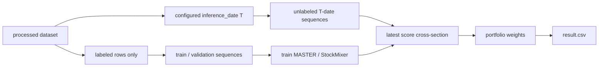
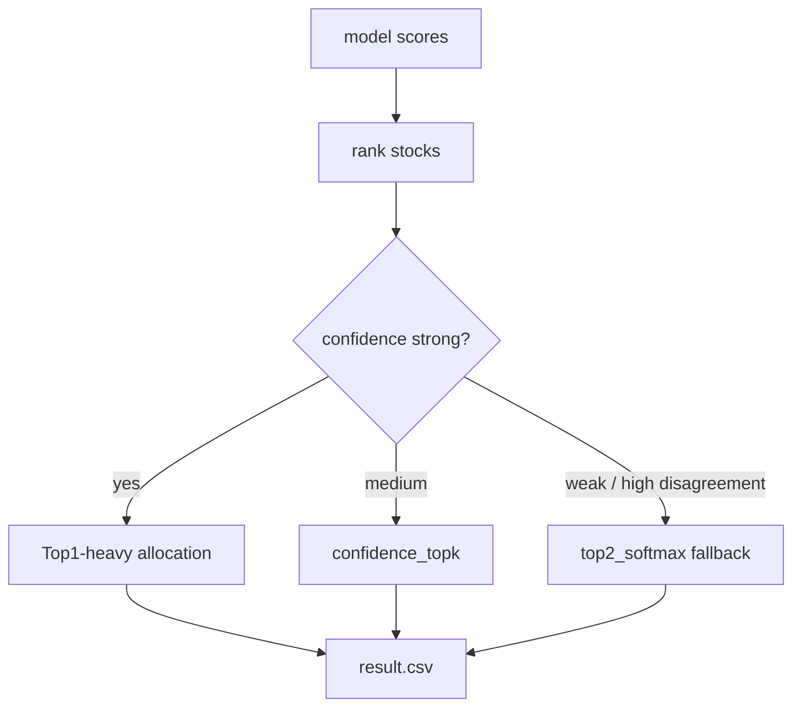
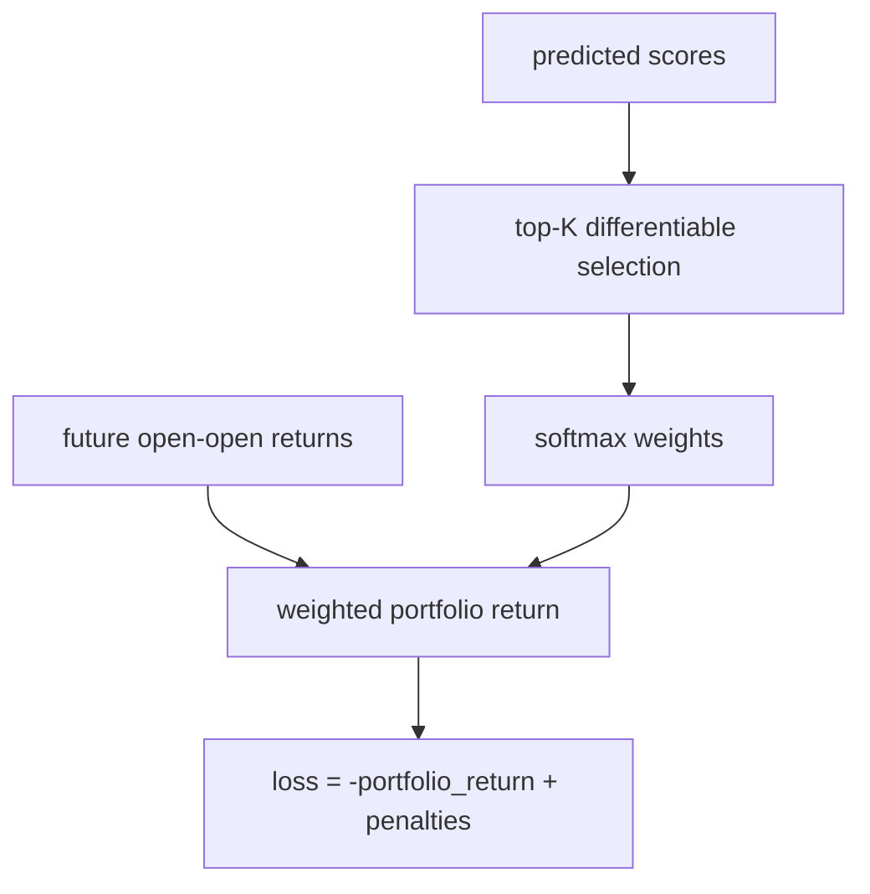
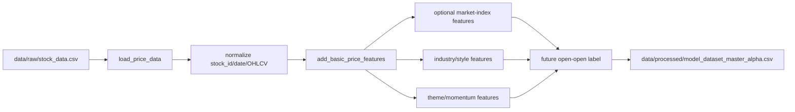

# Code Review Meeting Brief - 2026-05-07

## Meeting Goal

This review is intended to align the team on:

- what data the project actually uses;
- how the current pipeline generates a submission;
- which methods have worked and which have failed;
- where the largest risks are;
- what should be prioritized for the next competition phase.

## Executive Summary

The project has moved from a generic stock-return ranking pipeline to a more competition-aligned portfolio-selection system. The most important discovery was not a new model, but a date-alignment bug: earlier result generation used the last labeled validation day (`2026-04-20`) instead of the true unlabeled online inference date (`2026-04-24`).

After fixing latest inference and allowing concentrated portfolio allocation, the A-stage replay improved from the public score:

```text
0.012833583539611287
```

to:

```text
0.1066892464013548
```

The current production result is the aggressive Top1 version:

```csv
stock_id,weight
002493,1.0
```

However, Top1 is high variance. It is appropriate as a score-maximizing aggressive candidate, but not as the only long-term operating policy.

## Data Overview

### Raw Stock Data

Local raw file:

```text
data/raw/stock_data.csv
```

Shape:

```text
723,269 rows x 12 columns
```

Fields:

```text
股票代码, 日期, 开盘, 收盘, 最高, 最低, 成交量, 成交额,
振幅, 涨跌额, 换手率, 涨跌幅
```

Coverage:

```text
300 stocks
2,747 trading dates
date range shown by local file: 2015/1/12 -> 2026/4/9
```

The normalized processed table contains dates through `2026-04-24`, because supplementary/latest rows were included in the prepared modeling dataset.

### Processed Modeling Dataset

Local processed file:

```text
data/processed/model_dataset_master_alpha.csv
```

Shape:

```text
723,269 rows x 301 columns
```

Coverage:

```text
300 stocks
2,747 trading dates
2015-01-05 -> 2026-04-24
```

Feature groups:

- raw OHLCV and amount fields;
- short/medium window returns and volatility;
- moving-average ratios and price-position features;
- cross-sectional ranks and z-scores;
- industry and style features;
- beta/liquidity/volatility/correlation relation features;
- theme/momentum/breakout features.

### External Data Status

The current repo does not rely on pretrained external models.

The main data sources are:

- competition/local stock OHLCV data;
- HS300 stock list;
- local/generated processed features;
- AkShare-fetched realized A-stage replay prices used only for post-submit analysis, not for official training/prediction.

Important caveat:

```text
data/raw/hs300_index.csv is not present in the current local workspace.
```

Any market-index features must therefore be treated as optional or cached from earlier processed artifacts.

## Pipeline Overview

The system has four main stages:

1. Data normalization and feature generation.
2. Sequence construction for labeled training/validation.
3. Separate latest inference sequence construction for unlabeled T-day samples.
4. Portfolio construction and validation.

The fixed latest-inference logic is essential:

```text
Training: labeled samples only
Inference: unlabeled T-date cross-section
Submission: weights generated from T-date prediction scores
```

For A-stage replay:

```text
T = 2026-04-24
Buy open = 2026-04-27
Sell open = 2026-04-30
```

## Current Methods

### MASTER Official

MASTER-style model uses:

- stock feature projection;
- market/context projection where available;
- transformer encoder over stock sequences;
- market-guided gate;
- cross-attention and temporal pooling;
- regression/rank/correlation/listwise losses.

Strengths:

- best current single-model base;
- stable enough across 91 validation days;
- latest inference path now fixed;
- combines well with concentrated and confidence-aware portfolio policies.

Limitations:

- not inherently optimized for the final portfolio objective;
- Top1 output is high variance;
- portfolio-return loss prototype overfit when applied directly.

### StockMixer

StockMixer-style model uses:

- feature-group projection;
- channel and temporal mixer layers;
- recent-weighted pooling;
- multi-patch recent windows.

Strengths:

- lighter and faster than full MASTER;
- can be used as an elastic regime candidate;
- latest inference path now fixed for fast/official configs.

Limitations:

- current fast version underperforms MASTER on historical validation;
- official version is slower;
- candidate switching selected MASTER in the latest replay.

### Multi-Seed MASTER

Multi-seed MASTER averages scores across seeds and computes `score_std`.

Strengths:

- best historical mean in the multi-method validation table when paired with `top2_softmax`;
- exposes uncertainty through seed disagreement.

Limitations:

- latest inference support still needs to be completed end-to-end;
- generated historical results cannot yet directly replace production latest submission.

### Relation And Post-Processing

Relation post-processing adds:

- industry rank/mean effects;
- beta/volatility/liquidity proximity;
- historical correlation peers;
- regime risk adjustment.

Strengths:

- useful as a low-cost validation layer;
- helps test whether relational structure is valuable before implementing complex GNNs.

Limitations:

- can overfit validation windows;
- should be selected by walk-forward, not whole-validation search.

## Portfolio Construction Findings

The competition objective allows up to 5 stocks and total weight up to 1. There is no observed single-stock cap in the reviewed scoring rules.

Strategies tested:

- `top1_weight`
- `confidence_topk`
- `top2_softmax`
- `top3_softmax`
- `proportional_positive_thr0.0`

Key historical validation comparison:

| Method | Strategy | Mean | Std | Var | Neg Rate | Latest A Score |
|---|---|---:|---:|---:|---:|---:|
| master_multiseed | top2_softmax | 0.024498 | 0.049118 | 0.002413 | 0.340659 | n/a |
| master_official | top2_softmax | 0.021445 | 0.049134 | 0.002414 | 0.318681 | 0.049636 |
| master_official | top1_weight | 0.021298 | 0.065220 | 0.004254 | 0.373626 | 0.106689 |
| master_official | confidence_topk | 0.019817 | 0.052214 | 0.002726 | 0.362637 | 0.062790 |

Interpretation:

- `top1_weight` maximized this replay, but has the highest variance.
- `top2_softmax` is the best risk-adjusted fallback among current production-ready options.
- `confidence_topk` is a middle path that keeps Top1 dominant without going all-in.

## Portfolio-Return Training Experiment

The conceptual target is correct:

```text
maximize sum(weight_i(pred_score_T) * future_return_i(T+1,T+5))
```

But the first direct softmax portfolio-return loss did not improve MASTER.

Results:

| Method | Strategy | Mean | Std | Latest A Score |
|---|---|---:|---:|---:|
| master_official | top2_softmax | 0.021445 | 0.049134 | 0.049636 |
| master_official | top1_weight | 0.021298 | 0.065220 | 0.106689 |
| master_portfolio | top2_softmax | 0.004505 | 0.052009 | -0.009548 |
| master_portfolio | top1_weight | 0.002708 | 0.072972 | -0.051551 |

Walk-forward means for `master_alpha_portfolio_return`:

```text
20-day selection window: 0.000549
40-day selection window: 0.000682
60-day selection window: 0.000993
```

Conclusion:

The objective direction is right, but the direct implementation is too noisy. The next version should use a more robust surrogate:

- capped top-label listwise objective;
- downside-penalized portfolio objective;
- multi-seed averaging before portfolio construction;
- walk-forward-selected loss weights;
- uncertainty-aware allocation.

## Main Limitations

1. **Date alignment is fragile.**
   Every new phase must verify that prediction scores are generated for the true unlabeled T date.

2. **Top1 concentration is risky.**
   It can win big but has high drawdown and high negative-day rate.

3. **Validation can overfit.**
   Whole-validation parameter search overstated relation/post-processing quality.

4. **Market regime is only approximated.**
   Current regime handling is mostly post-processing and proxy based.

5. **Feature space is large and not fully audited.**
   Processed dataset has 301 columns; some features are optional depending on available raw files.

6. **Portfolio-return training is immature.**
   The first direct loss failed; it needs more careful objective design.

## Code Review Focus

Review these files first:

```text
src/training/dataset_builder.py
src/models/deep_sequence.py
src/models/master.py
src/models/stockmixer.py
src/portfolio/construct.py
scripts/train_master_baseline.py
scripts/train_stockmixer_baseline.py
scripts/simulate_online_windows.py
scripts/validate_multiple_methods.py
```

Specific review questions:

- Is latest inference guaranteed for every new T date?
- Should production default be `top1_weight`, `top2_softmax`, or `confidence_topk`?
- How should we gate Top1 concentration?
- Should relation post-processing remain external, or move into training/inference scripts?
- Which objective should replace direct portfolio-return softmax loss?

## Priority Review Pack With Source Excerpts

The meeting should review code in the order below. This order follows failure impact: first protect online date correctness, then portfolio risk, then validation robustness, then model objective design.

### P0 - Latest T-Date Inference Correctness

Why this is first:

The previous gap was caused by using the last labeled validation date instead of the true unlabeled online `T` date. If this breaks again, every downstream model and portfolio policy is optimizing the wrong cross-section.



Key source:

```python
# src/models/deep_sequence.py
def build_prediction_sequences(
    df: pd.DataFrame,
    feature_cols: Sequence[str],
    target_date: pd.Timestamp,
    *,
    ...
) -> tuple[np.ndarray, pd.DataFrame]:
    """Build model input sequences ending at target_date for stocks without labels."""
```

```python
# scripts/train_master_baseline.py
inference_date_value = cfg.get("inference_date")
inference_date = pd.to_datetime(inference_date_value) if inference_date_value else processed["date"].max()
infer_x, infer_meta = build_prediction_sequences(
    processed,
    feature_cols=feature_cols,
    target_date=inference_date,
    ...
)
dataset.x_infer = infer_x
dataset.infer_meta = infer_meta
```

Review questions:

- Is `inference_date` mandatory in every production config?
- Does every training script write `inference_date` and `n_inference_sequences` into metrics?
- Do we assert `latest_pred_df.date == configured T` before writing `result.csv`?
- Is there any fallback path still reading `valid_pred_df.max(date)`?

### P1 - Portfolio Risk And Dynamic Allocation

Why this is second:

The scoring function rewards concentrated portfolios, but Top1 has materially higher variance. The portfolio layer is where we decide whether to be aggressive or use a fallback.



Key source:

```python
# src/portfolio/construct.py
elif strategy == "confidence_topk":
    top = df.head(max(1, min(top_k, len(df)))).copy()
    scores = top["score"].to_numpy(dtype=float)
    std = top["score_std"].to_numpy(dtype=float) if "score_std" in top.columns else None
    margin = float(scores[0] - scores[1]) if len(scores) > 1 else abs(float(scores[0]))
    concentration = _confidence_concentration(
        top_score=float(scores[0]),
        margin=margin,
        score_std=float(std[0]) if std is not None else 0.0,
        ...
    )
```

Review questions:

- What is the production default: `top1_weight`, `confidence_topk`, or `top2_softmax`?
- Should `score_std` from multi-seed inference cap Top1 concentration?
- Should there be a max single-stock cap in our own risk policy even if the platform allows weight `1.0`?
- Do we record the selected strategy, score margin, and fallback reason with every submission?

### P1 - Walk-Forward Validation Instead Of Whole-Validation Search

Why this is tied for second:

Whole-validation parameter search can select a post-processing setting that only fits the historical window. Walk-forward validation better approximates how each future phase will be operated.


Key source:

```python
# scripts/simulate_online_windows.py
def walk_forward_simulation(
    pred_df: pd.DataFrame,
    strategies: Sequence[str],
    *,
    lookback_days: int,
    ...
) -> pd.DataFrame:
    ...
```

```python
# scripts/validate_multiple_methods.py
DEFAULT_STRATEGIES = [
    "top1_weight",
    "confidence_topk",
    "top2_softmax",
    "top3_softmax",
    "proportional_positive_thr0.0",
]
```

Review questions:

- Are strategy parameters selected only from information available before each simulated `T`?
- Do relation-postprocess parameters pass walk-forward checks, not only full-validation checks?
- Should the next phase use 20-day, 40-day, or ensemble lookback selection?

### P2 - Portfolio-Return Training Objective

Why this is not P0:

It is directionally aligned with the competition objective, but the first direct implementation underperformed. It should be reviewed as an experiment design problem, not a production blocker.



Key source:

```python
# src/models/master.py
def _portfolio_return_loss(
    pred: torch.Tensor,
    target: torch.Tensor,
    *,
    top_k: int,
    temperature: float,
) -> torch.Tensor:
    k = min(top_k, pred.numel())
    _, idx = torch.topk(pred, k=k)
    selected_pred = pred[idx]
    selected_target = target[idx]
    weights = torch.softmax(selected_pred / temperature, dim=0)
    portfolio_return = torch.sum(weights * selected_target)
    return -portfolio_return
```

Review questions:

- Should the objective use capped labels to prevent chasing extreme noise?
- Should negative-return days receive a downside penalty?
- Should the loss operate on daily groups only, never mixed dates?
- Should portfolio loss be blended late in training rather than from epoch 1?

### P2 - Data Engineering And Feature Audit

Data pipeline:



Key source:

```python
# src/training/dataset_builder.py
def build_model_dataset(...):
    df = load_price_data(config.raw_dir)
    df = add_basic_price_features(df, config.windows)
    if config.market_index_path and Path(config.market_index_path).exists():
        index_df = load_market_index_frame(config.market_index_path)
        df = add_market_index_features(df, index_df, config.windows)
    if config.industry_map_path and Path(config.industry_map_path).exists():
        industry_df = load_industry_map(config.industry_map_path)
        df = add_industry_features(df, industry_df, config.windows)
    df = add_forward_return_label(df, label_name=config.label_name, ...)
    return df
```

Example processed T-date rows:

```csv
stock_id,date,open,close,volume,ret_1,ret_5,volume_ratio_5,y_ret_a_stage_round1_open_open
000001,2026-04-24,1327.8349521,1330.253595,58271012.0,0.0,-0.000908,-0.169174,
000002,2026-04-24,510.281499,503.56726875,90444334.0,-0.015748,-0.053030,0.060523,
000063,2026-04-24,500.44384722,497.84378348,103407016.0,-0.012754,0.029720,-0.177777,
```

Interpretation:

- `2026-04-24` is the online inference date in A-stage replay.
- The target label is intentionally blank for that day before replay labels are fetched.
- Inference should use features up to `T`, not realized prices from `T+1` to `T+5`.
- Replay realized prices are used only after submission to evaluate what would have happened.

Concrete data engineering checks:

- Verify every stock has enough historical lookback rows before sequence construction.
- Verify no feature uses `shift(-n)` except explicit label columns.
- Verify generated feature columns for a new phase exist in the processed artifact. Theme/momentum code can exist while the current cached processed file still lacks rebuilt columns.
- Verify missing optional files such as `data/raw/hs300_index.csv` trigger documented fallbacks instead of silent feature drift.
- Verify `stock_id` remains zero-padded as text all the way to `result.csv`.

## Recommended Roadmap

### Immediate

- Make phase date `T` an explicit config field everywhere.
- Add an automated assertion: latest prediction date must equal configured inference date.
- Add production switch for aggressive vs fallback portfolio policy.
- Extend latest inference to multi-seed MASTER.

### Next Experiment

- Train multi-seed latest MASTER.
- Compare:
  - `master_multiseed + top2_softmax`
  - `master_multiseed + confidence_topk`
  - `master_official + top1_weight`
  - `master_official + top2_softmax`
- Use walk-forward selection, not whole-validation selection.

### Longer Term

- Build robust portfolio objective with downside penalty.
- Add regime-aware concentration gating.
- Validate theme/momentum features in the next phase.
- Consider GNN/HIST-style relation learning only after post-processing relation gains remain stable under walk-forward.
